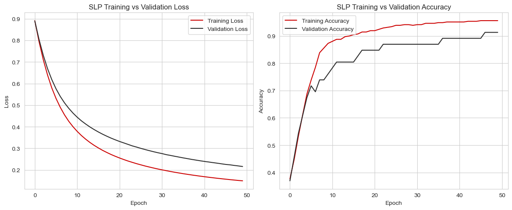
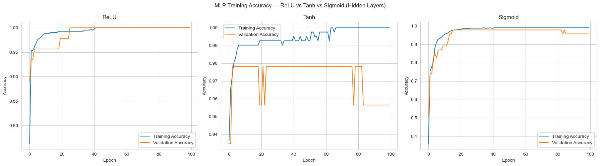
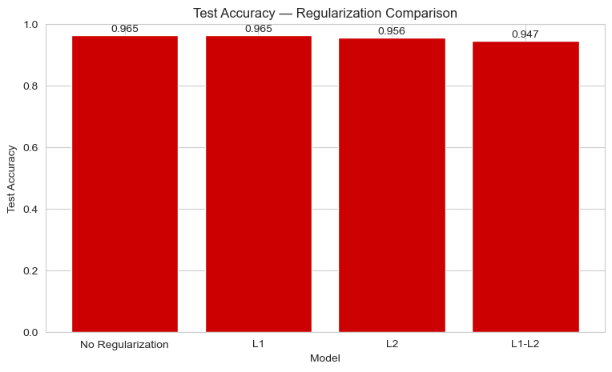
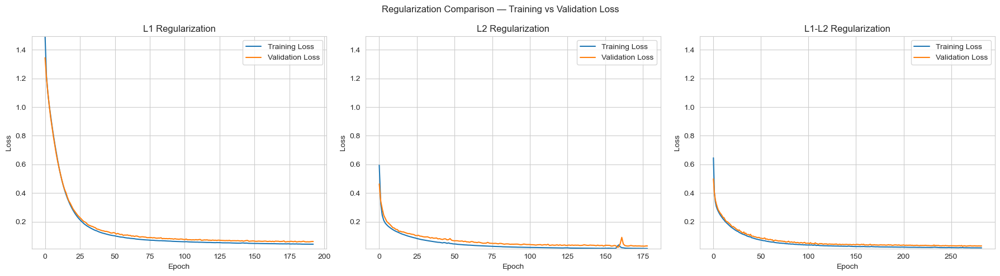
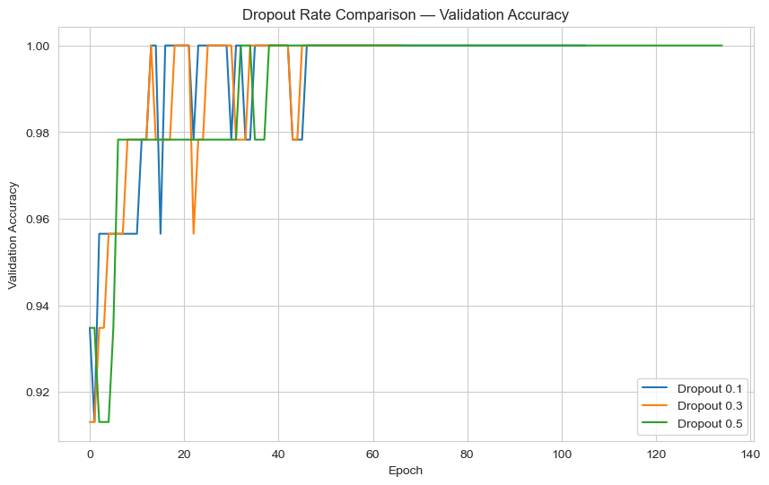
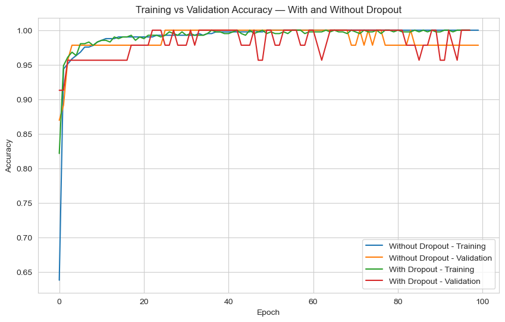
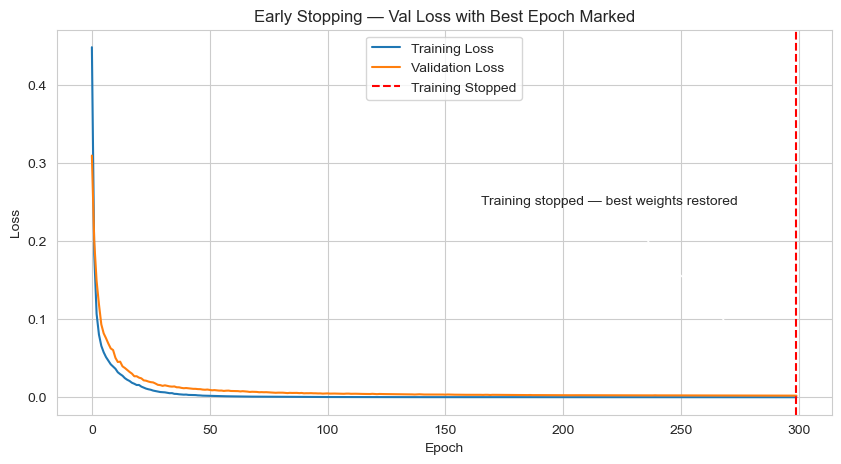
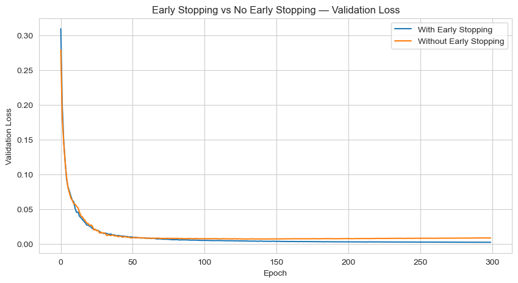

<div align="center">

# 🧠 Neural Network Regularization Techniques Comparison

### Deep Learning Performance Analysis using TensorFlow & Keras


**Comparative Study of Regularization Techniques in Multi-Layer Perceptrons (MLPs)**

</div>

---

# 📌 Project Overview

This project evaluates the impact of different **regularization techniques** on the performance of Multi-Layer Perceptron (MLP) models using TensorFlow/Keras.

The study compares multiple neural network configurations and demonstrates how different techniques improve **generalization**, reduce **overfitting**, and enhance **classification performance**.

---

# 🎯 Objectives

- ✅ Build baseline neural network models
- ✅ Compare different activation functions
- ✅ Apply L1, L2 and L1+L2 Regularization
- ✅ Analyze different Dropout Rates
- ✅ Implement Early Stopping
- ✅ Compare Training & Validation Performance
- ✅ Evaluate using Accuracy, Precision, Recall and F1-Score

---

# 🛠 Technologies Used

| Technology | Purpose |
|------------|----------|
| 🐍 Python | Programming Language |
| 🔥 TensorFlow | Deep Learning |
| 🧠 Keras | Neural Network API |
| 📊 Matplotlib | Visualization |
| 📈 Pandas | Data Processing |
| 🔢 NumPy | Numerical Computing |
| 🤖 Scikit-Learn | Evaluation Metrics |
| 📒 Jupyter Notebook | Development |

---
# 📊 Dataset

**Source:** `sklearn.datasets.load_breast_cancer`

| Property | Value |
|---|---:|
| Total Samples | 569 |
| Input Features | 30 |
| Classes | 2 |
| Malignant (0) | 212 |
| Benign (1) | 357 |
| Problem Type | Binary Classification |

### Target Classes

```text
0 → Malignant
1 → Benign
```
# 📂 Project Structure

```
Neural-Network-Regularization/
│
├── PR_1.ipynb
├── requirements.txt
├── README.md
│
├── Images/
│   ├── SLP.png
│   ├── relu_vs_tanh_vs_sigmoid.png
│   ├── barchart.png
│   ├── dropout.png
│   ├── l1_l2_l1l2.png
│   ├── train_vs_validation.png
│   ├── with_without_earlystoping.png
│   ├── earlystoping_1.png
│   └── final.png
```

---

# 🔄 Project Workflow

```text
Dataset
   ↓
EDA
   ↓
Train/Test Split
   ↓
StandardScaler
   ↓
SLP Baseline
   ↓
MLP
   ↓
ReLU vs Tanh vs Sigmoid
   ↓
Early Stopping
   ↓
Dropout
   ↓
L1 / L2 / L1-L2
   ↓
Final Combined Model
   ↓
Model Comparison
   ↓
Clinical Insight
```
---

# 📈 Experimental Results

---

## 🔹 1. SLP Performance



The Single Layer Perceptron serves as the baseline model. Training and validation curves indicate gradual convergence with comparatively lower accuracy.

---

## 🔹 2. Activation Function Comparison



Comparison between:

- ReLU
- Tanh
- Sigmoid

**Observation**

- ReLU converges fastest.
- Tanh is stable but slightly slower.
- Sigmoid suffers from slower learning.

---

## 🔹 3. Regularization Comparison



Comparison of

- No Regularization
- L1
- L2
- L1 + L2

---

## 🔹 4. Training vs Validation Loss



Shows how regularization reduces overfitting while maintaining good validation performance.

---

## 🔹 5. Dropout Comparison



Dropout Rates Tested

- 0.1
- 0.3
- 0.5

---

## 🔹 6. Training vs Validation Accuracy



Comparison between

- Without Dropout
- With Dropout

---

## 🔹 7. Early Stopping



Training automatically stops once validation loss stops improving.

Benefits

- Prevents overfitting
- Saves computation time
- Restores best model weights

---

## 🔹 8. Early Stopping vs Without Early Stopping



Shows validation loss comparison with and without Early Stopping.

---

## 🔹 9. Final Model Performance


Final comparison of all models based on

- Accuracy
- Precision
- Recall
- F1-Score

---

# 📋 Performance Metrics

The models were evaluated using:

- ✅ Accuracy
- ✅ Precision
- ✅ Recall
- ✅ F1 Score

---

# 🚀 Key Findings

✔ ReLU provides the fastest convergence.

✔ L2 Regularization effectively reduces overfitting.

✔ Dropout improves model generalization.

✔ Early Stopping prevents unnecessary training.

✔ Combining multiple regularization techniques produces a more robust model.

---

# 📦 Requirements

```
Python 3.10+
TensorFlow
Keras
NumPy
Pandas
Matplotlib
Scikit-Learn
Jupyter Notebook
```

---

# ▶️ Run the Project

```bash
pip install -r requirements.txt

jupyter notebook PR_1.ipynb
```

---

# 📸 Output

The notebook generates

- Training Curves
- Validation Curves
- Accuracy Graphs
- Loss Graphs
- Regularization Comparison
- Dropout Analysis
- Final Performance Table

---

<div align="center">

### ⭐ If you found this project helpful, don't forget to Star the Repository!

Made with ❤️ using TensorFlow & Keras

</div>
